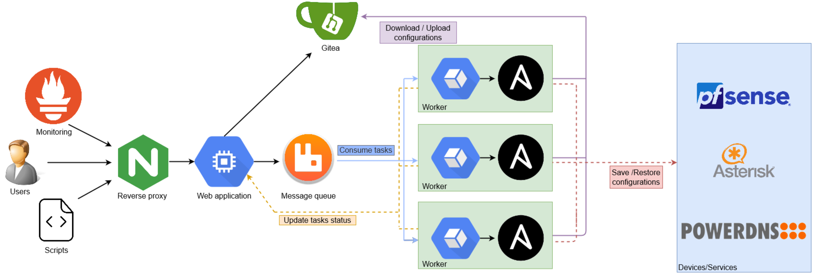

ConfigurationsManagement is a website that helps you to backup/restore devices/services. An API is available to automate
backup/restore. ConfigurationsManagement send task to execute to ConfigurationsManagement-worker through RabbitMQ Work queues. Files are saved 
in a Gitea server. Backup/Restore script are Ansible Playbooks.

[ConfigurationsManagement-worker](https://github.com/M0NsTeRRR/ConfigurationsManagement-worker)

#### Architecture

# Requirements
- Python > 3.6
- Pip
- Docker (For Docker installation only)
- Gitea >= 1.10

# Install

**Be sure to use the same version of the code as the version of the docs
you're reading.**

    # clone the repository
    $ git clone https://github.com/M0NsTeRRR/ConfigurationsManagement
    $ cd ConfigurationsManagement
    # checkout the correct version
    $ git tag # shows the tagged versions
    $ git checkout <latest-tag-found-above>

## Install dependencies

    $ pip install -e .

# Configuration
Create the config file `instance/config.py` or fill environment variable based on `config.example`
Example : To configure host of rabbitmq it will be RABBITMQ_HOST

# Run
## Production
### Linux
    $ export FLASK_APP=website
    $ export FLASK_ENV=production
    $ pip install -e .[production]
    $ gunicorn -w 4 website.wsgi:app --bind 0.0.0.0:8000

Init database `flask init-db`
Compile translations with this [command](#extract-strings)  
Create an user `flask create-user <login> <password>`  
Install a webserver like Nginx and configure it to proxy pass request to gunicorn
(for configuration example : nginx.conf)  

### Docker
Start containers with your environment variable (same name as config.py)  
`docker run -d -p 8000:8000 -e "DEBUG=False" <etc... for others env> -name configurationsmanagement monsterrr/configurationsmanagement:latest`  
Create an user `docker exec -it configurationsmanagement flask create-user <login> <password>`  
Access to the website `http://<ip>:8000`

## Dev
#### Linux

    $ export FLASK_APP=website
    $ export FLASK_ENV=development

#### Windows

    > set FLASK_APP=website
    > set FLASK_ENV=development

Init database `flask init-db`
Compile translations with this [command](#extract-strings)
Create an user `flask create-user <login> <password>`  

    > flask run

# Translation
## Extract strings
Extract strings from python file located in `website/`.

    pybabel extract -F babel.cfg -o website/translations/messages.pot .

## Add new translation
To create german translation replace <language> by "de".

    pybabel init -i website/translations/messages.pot -d website/translations -l <language>

## Compile translation
Translation files are saved in `website/translations`.
After editing translations you need to recompile it.

    pybabel compile -d website/translations

## Change strings
Extract the strings and use pybabel to merge changes.

    pybabel update -i website/translations/messages.pot -d website/translations

# Test

    $ pip install .[test]
    $ pytest
    Check python code style
    $ flake8 website
    

Compile [translations](#translation)  
Fill `tests/config.json` with the appropriate values  

Run with coverage report:

    $ coverage run -m pytest
    $ coverage report
    $ coverage html  # open htmlcov/index.html in a browser

# Licence

The code is under CeCILL license.

You can find all details here: https://cecill.info/licences/Licence_CeCILL_V2.1-en.html

# Credits

Copyright © Ludovic Ortega, 2019

Contributor(s):

-Ortega Ludovic - mastership@hotmail.fr